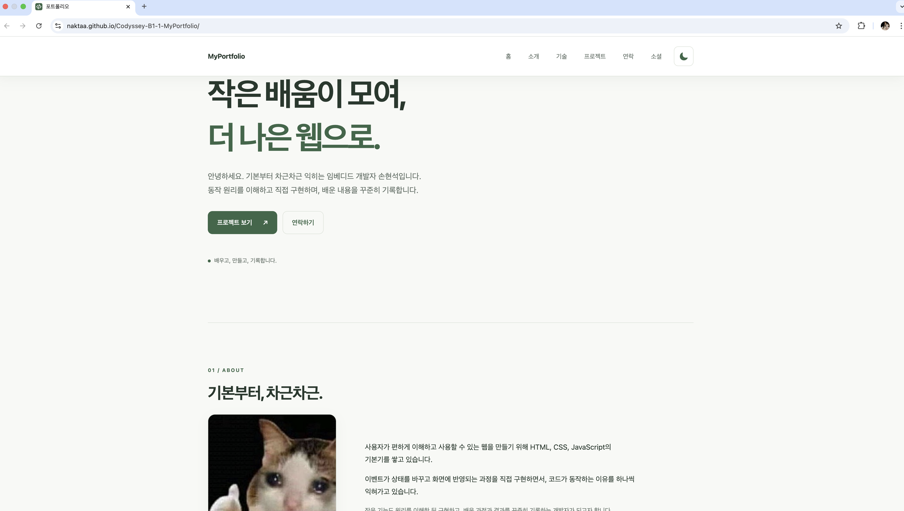
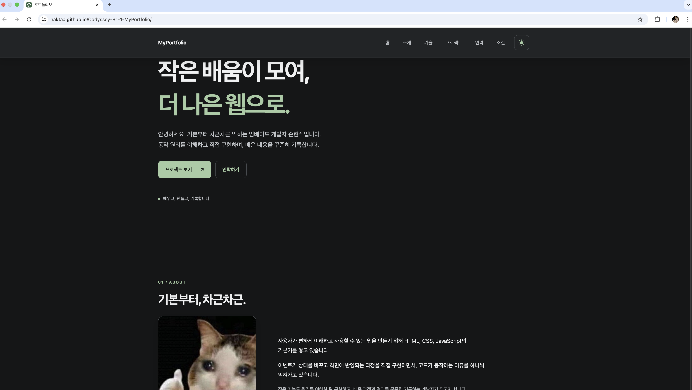
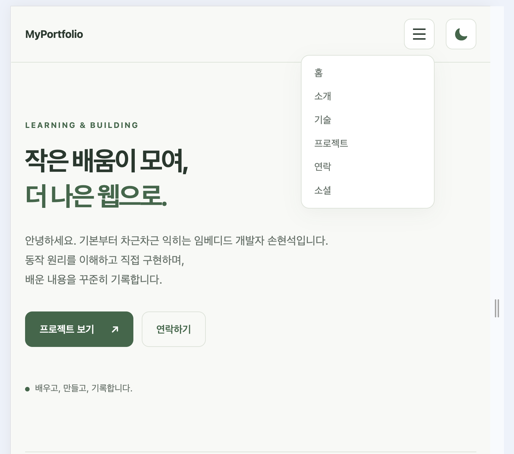

# B1-1 Portfolio

## 프로젝트 소개

순수 HTML, CSS, JavaScript로 만든 손현석의 반응형 포트폴리오입니다. 프레임워크 없이 사용자 이벤트, 상태 변경, DOM 업데이트가 화면 변화로 이어지는 과정을 구현했습니다.

- 배포 사이트: https://naktaa.github.io/Codyssey-B1-1-MyPortfolio/
- GitHub 저장소: https://github.com/naktaa/Codyssey-B1-1-MyPortfolio

## 프로젝트 구조

```text
.
├── index.html
├── css/
│   └── style.css
├── js/
│   └── main.js
├── images/
│   ├── favicon.svg
│   └── profile-cat.jpg
├── docs/
│   ├── mission-original.md
│   ├── requirements.md
│   ├── troubleshooting.md
│   └── worklog.md
└── evidence/
```

## 사용 기술

- HTML5
- CSS3
- Vanilla JavaScript
- GitHub REST API
- GitHub Pages

## 주요 기능

- Hero, About, Skills, Projects, Contact, Footer 시맨틱 구조
- 768px·1024px 기준 모바일 퍼스트 반응형 레이아웃
- 햄버거 메뉴와 섹션 부드러운 이동
- 스크롤 시 헤더 변경과 맨 위로 버튼
- 다크 모드 전환, `localStorage` 저장·복원
- Intersection Observer 기반 스크롤 표시 애니메이션
- 이름·이메일·메시지 폼 유효성 검사
- GitHub 저장소 loading·success·empty·error 렌더링과 재시도
- 선택 기능: GitHub 저장소 언어별 필터
- 키보드 초점, ARIA 속성, 동작 줄이기 설정 대응

Contact 폼은 입력 검증 데모이며 실제 이메일은 전송하지 않습니다.

## 이벤트 → 상태 → 렌더링

| 기능 | 이벤트 | 상태 변경 | DOM·화면 변화 |
| --- | --- | --- | --- |
| 테마 | 테마 버튼 `click` | `currentTheme` 변경 및 저장 | `data-theme`, 아이콘, ARIA 갱신 |
| 모바일 메뉴 | 메뉴 버튼 `click` | `isMenuOpen` 변경 | 메뉴 클래스와 ARIA 갱신 |
| Contact | 필드 `input`, 폼 `submit` | 오류·제출 상태 변경 | 필드 오류와 성공 안내 갱신 |
| Projects | API 요청·재시도 | loading/success/empty/error | 상태 안내, 카드, 재시도 버튼 갱신 |
| 프로젝트 필터 | 필터 버튼 `click` | `selectedLanguage` 변경 | `filter()` 결과 카드와 개수 갱신 |

## 구현 핵심

- **상태와 렌더링 분리:** 프레임워크 없이 기능별 상태를 변수·객체로 관리합니다. 이벤트에서 상태를 변경한 뒤 `renderTheme`, `renderMenu`, `renderContactForm`, `renderProjects`가 관련 DOM만 갱신합니다.
- **테마 상태 유지:** `currentTheme`을 기준으로 `data-theme`과 버튼 정보를 렌더링하고, 선택값을 `localStorage`에 저장해 새로고침 후에도 복원합니다.
- **Contact 검증:** `input`마다 해당 필드의 오류를 `contactState`에 반영하고, `submit`에서는 전체 필드를 다시 검사한 뒤 오류 또는 성공 상태를 렌더링합니다. 실제 이메일은 전송하지 않습니다.
- **GitHub API 상태 처리:** 별도 백엔드 서버 없이 `loadProjects`가 GitHub REST API를 호출합니다. 요청 전 loading 상태를 먼저 렌더링하고, `fetch` 결과를 success·empty·error로 나눠 `renderProjects`에 전달합니다. 요청 제한, 비정상 응답, 네트워크 오류와 15초 시간 초과를 처리하며 오류 시 같은 요청을 재시도할 수 있습니다.

## 실행 방법

1. 저장소를 내려받습니다.
2. VS Code에서 프로젝트 폴더를 엽니다.
3. Live Server로 `index.html`을 실행합니다.
4. 최신 Chrome에서 확인합니다.

별도의 패키지 설치나 빌드 과정은 없습니다.

## GitHub Projects

페이지를 열면 다음 엔드포인트에서 `naktaa`의 공개 저장소를 최근 업데이트 순으로 최대 100개 가져옵니다.

```text
https://api.github.com/users/naktaa/repos?sort=updated&per_page=100
```

- `fetch`, `async/await`, `try/catch`, `response.ok` 사용
- loading, success, empty, error 상태 구분
- 403·429 요청 제한과 네트워크·시간 초과 오류 처리
- 오류 상태에서 같은 요청을 실행하는 재시도 버튼 제공
- 저장소 Description이 없으면 설명 문단 생략
- API 응답의 주 언어로 필터 버튼 생성

## 동작 기준값

| 항목 | 기준값 |
| --- | --- |
| 스크롤 시 헤더 스타일 변경 | `window.scrollY >= 60` |
| 맨 위로 버튼 표시 | `window.scrollY >= 300` |
| Intersection Observer | `threshold: 0.2` |

## 배포

- 배포 방식: GitHub Pages, `main` 브랜치의 `/(root)`
- 배포 URL: https://naktaa.github.io/Codyssey-B1-1-MyPortfolio/
- 저장소 URL: https://github.com/naktaa/Codyssey-B1-1-MyPortfolio

## 스크린샷

| 데스크톱 밝은 모드 | 데스크톱 다크 모드 |
| --- | --- |
|  |  |

### 모바일 밝은 모드


